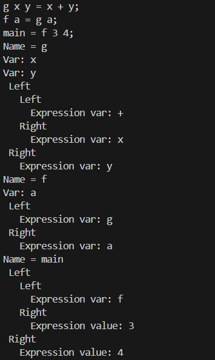

# Интерпретатор функционального языка **Calpi**
## Выполнили
- Голиков Андрей Сергеевич P33092
- Рогачев Михаил Сергеевич P33082

## Описание языка

**Calpi** - функциональный язык. Язык умеет обрабатывать целочисленный тип данных и логический тип данных. Также предоставляется поддержка ветвления за счет конструкции **case**, обявление локальных функций и лямбда-выражения. Также поддерживаются многострочные комментарии

## Грамматика и лексический состав языка

**Грамматика в форме Бэкуса-Наура**:

``` ebnf
Program: Supercombinators  

Supercombinators: Supercombinator; Supercombinators        
    | Supercombinator;

Supercombinator: Vars = Expression 

Vars: Var Vars                              
    | Var                                  

Var: NAME                                   

Expression: LET Defuns IN Expression        
    | CASE Expression IN Alts               
    | \ Vars -> Expression          
    | expr1                                 

expr1: expr2 || expr1          
    | expr2                     

expr2: expr3 && expr2          
    | expr3                    

expr3: expr4 relop expr4       
    | expr4                    

expr4: expr5 + expr4         
    | expr5 - expr5         
    | expr5                     

expr5: expr6 * expr5         
    | expr6 / expr6       
    | expr6 % expr6           
    | expr6                     

expr6: Aexprs 

Defuns: Defun; Defuns    
    | Defun;           
    | Defun                      

Defun: Var = Expression   

Alts: Alt; Alts    
    | Alt;

Alt: DIGIT Vars -> Expression   

relop: < | <= | > | >= | == | !=

Aexprs: Aexprs Aexpr                    
    | Aexpr                             

Aexpr: Var                              
    | DIGIT                             
    | (expression)      
    
NAME: [a-zA-Z]+

DIGIT: [+-]?[0-9]+
```

- Реализацию грамматики можно увидеть в [parser/another.y](pareser/another.y)

- Лексический состав языка можно увидеть в [lexer/lexer.l](lexer/lexer.l)

## Сборка и запуск

Сборка осуществляется с помощью правила:

> ```make compile``` 

Запуск интерактивного режима интерпретатора происходит с помощью:

> ```make run```

Тестовые сценарии можно увидеть в [example.cal](example.cal)

## Пример разбора



## Описание автомата

- Интерпретатор это автомат, у которого состояние это пятерка объектов - stack, dump, heap, globals, stat.
  
Stat - статистика, которую может пригодиться собирать, на данном этапе это просто число редукций, совершаемых автоматом

Heap - область храненя объектов разбора языка.

Globals - список пар ключ-значение для глобальных имен, таких как названия функций и примитивные операции (тоже, по сути названия функций). Туда же при необходимости можно будет добавить встроенные операции стандартной библиотеки.

Stack - как нетрудно догадаться, стек, в котором хранятся адреса нод кучи, которые надо вычислить. В зависимости от типа ноды автомат делает различные действия (если это число, то все хорошо - оно уже вычислено, если это применение функции - надо вычислить операнды и т.п.)

Dump - стек стеков для вычисления сложных операций (порядок вычисления арифметики, например).

- Завершающее состояние автомата это состояние, в котором дамп пустой, длина стека равна 1, а по адресу из вершины стека лежит число - результат вычисления программы.

- Начальное состояние формируется функцией compile из структуры, выдаваемой парсером (регистрируются суперкомбинаторы и примитивные операции, адрес main помещается на вершину стека)
